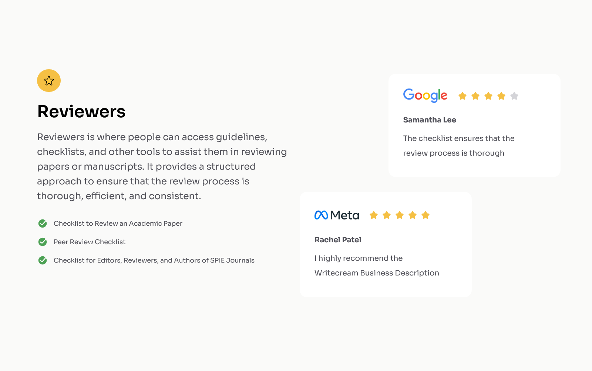

# Testimonial Page

This is a small project I made to train with HTML, CSS and Flexbox.

## Table of Content

- [Overview](#overview)
  - [Description](#description)
  - [Screenshot](#screenshot)
  - [Links](#links)
- [My process](#my-process)
  - [Built with](#built-with)
  - [What I learned](#what-i-learned)
  - [Continued Development](#continued-development)
  - [Useful Resources](#useful-resources)
- [Author](#author)
- [Acknowledgments](#acknowledgments)

## Overview

### Description

I present to you a small project I made. The main objective was to work with HTML, CSS and Flexbox to perfect my knowledge with those technologies.
It consist of a simple testimonial page containing a text as intro and two commentary.
This project works on all device, from smartphone to desktop computer !

### Screenshot



### Links

- [Live Site](https://sephydev.github.io/testimonial-page/)

## My process

### Built with

- Semantic HTML5
- CSS
- Flexbox

### What I learned

Thanks to this project, I've practiced some semantic HTML, CSS and Flexbox. The following snippets are some examples of the knowledges I used.

- Semantic HTML5 (`<div class="text">`):

```html
<div class="text">
  <span aria-hidden>⭐️</span>
  <h1>Reviewers</h1>
  <p>
    Reviewers is where people can access guidelines, checklists, and other tools
    to assist them in reviewing papers or manuscripts. It provides a structured
    approach to ensure that the review process is thorough, efficient, and
    consistent.
  </p>
  <ul>
    <li>
      Checklist to Review an Academic Paper
    </li>
    <li>
      Peer Review Checklist
    </li>
    <li>
      Checklist for Editors, Reviewers, and Authors of SPIE Journals
    </li>
  </ul>
</div>
```

- CSS (`ul`):

```css
ul {
  font-size: 0.875rem;
  color: #52525a;
  list-style: none;
  padding: 0;
  margin-top: 2rem;
}
```

- Flexbox (`.commentary`):

```css
.commentary {
  display: flex;
  flex-direction: column;
  background-color: #ffffff;
  padding: 2rem 2rem;
  border-radius: 1rem;
  margin: 0rem 0;
  width: 100%;
}
```

### Continued Development

Seeing how Flexbox simplify webpage organization, I will continue to master these technologie.
I will do that by using those on other project, notably to make responsive website.

### Useful Resources

- [Guide to Flexbox (CSS Trick)](https://css-tricks.com/snippets/css/a-guide-to-flexbox/)

## Author

- Website : Sephydev

## Acknowledgment

Thanks to my friends and my family for supporting me while I journey in the land of Web Development, and during the making of this project !
